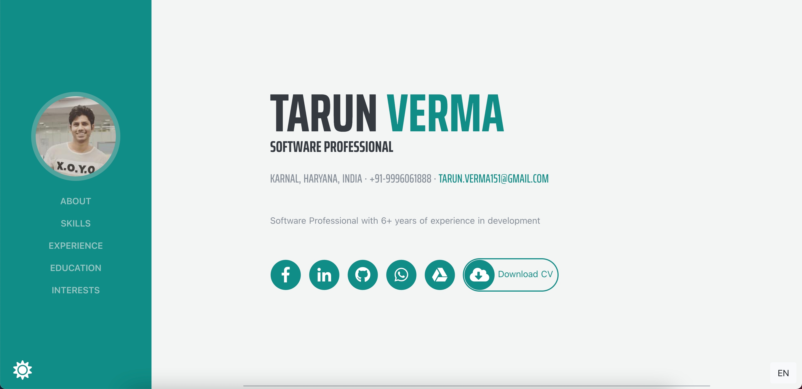
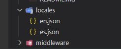

# web-portfolio

An easy way to **build** you own personal web resume!! 💪

### [Demo - Tarun](https://tarun-verma.web.app)

---




---

## Pre-Requisites 

- Install [NodeJS](https://nodejs.org/)


##  How to start? 🥳
1) **Clone** the **repository**
2) **Install** dependencies:
  - `$ npm install`
3) **Build** application:
  - `$ npm run build`
4) **Run** in **dev mode**:
  - `$ npm run dev`


## Configuration ⚙

***You can easily customize the template and the languages!*** 🚀
- To do this, you have to **edit** the **locales** files as you want! 📄



### Languages Files 🌍
**English**: `./locales/en.json`

### Add new Language
1) **Create** a new language file in the folder `./locales` :
- **eg.** : `fr.json or es.json`
2) **Change** **i18n** configuration in the ***nuxt.config.js***, 
```javascript
i18n: {
	locales: ['en', 'es', 'fr'],
	defaultLocale:  'en',
	vueI18n: {
		fallbackLocale:  'en',
		messages: {
			en:  require('./locales/en.json'),
			es:  require('./locales/es.json'),
			fr:  require('./locales/fr.json')
		}
	}
},
```
3) You can easily change the actual language by following way:
```html
<div>
	<nuxt-link class="btn btn-light" :to="switchLocalePath('en')">EN</nuxt-link>
	<nuxt-link class="btn btn-light" :to="switchLocalePath('es')">ES</nuxt-link>
	<nuxt-link class="btn btn-light" :to="switchLocalePath('fr')">FR</nuxt-link>
</div>
```

##  Generate static code 🥳
1) In the **root** folder, run the following command:
- `$ npm run generate`
2) All the **generated** code will be apear in the `./dist` folder.


## Firebase Hosting:
1)	Install firebase cli
		```npm install -g firebase-tools```
2)	Login to firebase:
		```firebase login```
1)	Add a secret to your repository : FIREBASE_TOKEN . vaue should be your token generated from ```firebase login``` command
2)	Modify the ```.firebaserc```
```
{
  "projects": {
    "default": "FIREBASE-PROJECT-ID"
  }
}
```